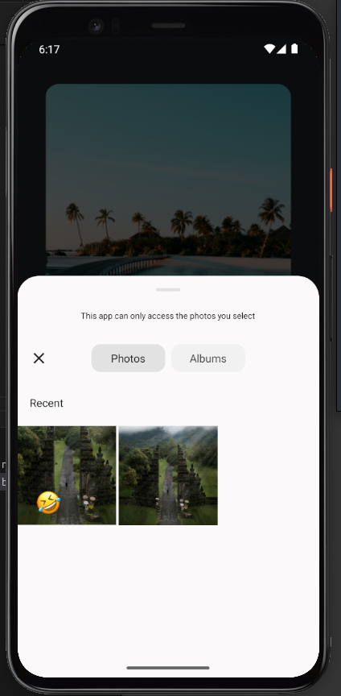

### Sticker Smash App

#### About Sticker Smash
Welcome to Sticker Smash!

Sticker Smash allows you to create and interact with stickers in a mobile app environment. You can select images from your device's media library, add them as stickers, and use touch gestures to interact with them. Capture and save screenshots of your creations directly within the app.

#### Features
- **Image Selection:** Choose images from your device to use as stickers.
- **Sticker Modal:** Modal interface for selecting and interacting with stickers.
- **Touch Gestures:** Use gestures to move, resize, and interact with stickers.
- **Screenshot Capture:** Capture and save your sticker creations as screenshots.
- **Platform Compatibility:** Supports Android, iOS, and web platforms.

#### Screenshots




#### Get Started
Ready to unleash your creativity with stickers? Clone the repository and follow these steps to start using Sticker Smash:

#### How to Install and Run
1. Ensure you have Node.js installed on your machine.
2. Install Expo CLI globally:
   ```sh
   npm install -g expo-cli
   ```
3. Clone this repository to your local machine:
   ```sh
   git clone https://github.com/Dharam-IN/React-Native-StickerSmash
   ```
4. Navigate to the project directory:
   ```sh
   cd React-Native-StickerSmash
   ```
5. Install dependencies:
   ```sh
   npm install
   # or
   yarn install
   ```
6. Start the Expo development server:
   ```sh
   expo start
   ```
7. Use the Expo Go app on your smartphone to scan the QR code and open the app.

#### Deployment
To deploy your own version of Sticker Smash:
1. Sign up for an Expo account and follow their deployment guides.
2. Build the app using `expo build`.

#### Credits
- **React Native:** Framework for building native mobile apps using React.
- **Expo:** Toolchain for simplifying React Native development.
- **AsyncStorage:** For storing app data locally.

#### Author
- Dharam-IN

Feel free to customize this README file according to your project's specifics and preferences.